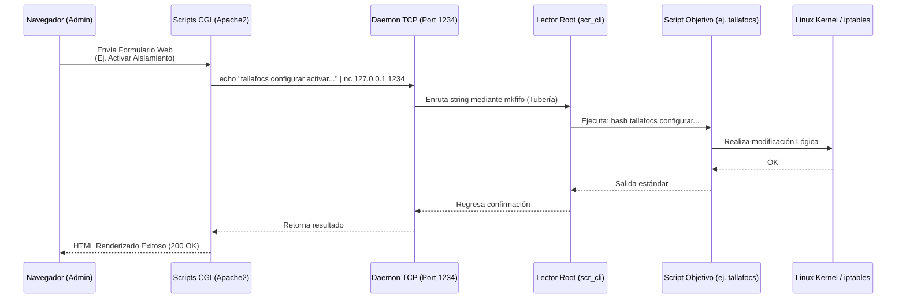

# JSBach - Router & Firewall Appliance

JSBach es un sistema de gestión y configuración de red ligero, modular y robusto, escrito completamente en scripts de Bash desarrollados para operar en un entorno Linux (especialmente Debian/Ubuntu).

Su propósito principal es convertir un PC estándar o servidor Linux en un dispositivo de enrutamiento (Router/Firewall) de altas prestaciones administrable vía interfaz web. JSBach abstrae y automatiza herramientas clave de red del kernel de Linux como `iptables`, `ebtables`, `iproute2` y `bridge-utils` desde una interfaz unificada.

---

## 🚀 Características Principales

*   **Gestión de WAN Automática/Estática:** Soporte para clientes DHCP o IP fijas con modificación en caliente de los servidores DNS nativos de `systemd-resolved`.
*   **Enrutamiento y NAT:** Habilitación inmediata de reenvío de paquetes (IP Forwarding) y enmascaramiento (`MASQUERADE`) para otorgar paso a Internet a clientes locales.
*   **Conmutación Local y VLANs (Switching):** Creación e integración de puentes lógicos (`br0`) en múltiples interfaces físicas. Soporte de puertos trunk (tagged) y accesos nativos (untagged).
*   **Seguridad y Cortafuegos por Zonas:** Aislamiento estricto de redes a través de esquemas modulares en `iptables` (Admin, Usuarios, DMZ).
*   **Zona Desmilitarizada (DMZ) Nativa:** Reescritura automatizada de cabeceras (Port Forwarding / DNAT) para exportar servicios locales hacia el exterior de forma segura.
*   **Filtros de Capa 2 (Ebtables):** Controles potentes para truncar o aislar el tráfico de salto (pivoting) en capa de enlace (MAC).
*   **Interfaz Web Gráfica (CGI):** Dashboard basado en `Apache2`, escrito desde cero mediante Bash CGI.

---

## 🏗️ Arquitectura de Red y Topología

El ecosistema crea un bloque central (Bridge Lógico `br0`) que segmenta las redes internas e interactúa con el Exterior (WAN) a través de reglas centralizadas.

```mermaid
graph TD
    classDef external fill:#f9d0c4,stroke:#e85d04,stroke-width:2px,color:#000;
    classDef router fill:#d0f0c0,stroke:#2b9348,stroke-width:2px,color:#000;
    classDef vlan fill:#cce3de,stroke:#0077b6,stroke-width:2px,color:#000;
    classDef dmz fill:#ffd6a5,stroke:#fd9c42,stroke-width:2px,color:#000;

    Internet((Internet / ISP)):::external <--> WAN[Interfaz WAN<br>Ej. enp6s0]:::external
    
    subgraph JSBach Router (Sistema Linux)
        WAN <--> IPTable_NAT[NAT / Enmascaramiento<br>script: enrutar]:::router
        IPTable_NAT <--> IPTables_FW[Cortafuegos Global<br>script: tallafocs]:::router
        IPTables_FW <--> BR0[Switch Lógico Internal<br>script: bridge / br0]:::router
        
        BR0 <--> VLAN_A[br0.1<br>VLAN 1: Admin]:::vlan
        BR0 <--> VLAN_D[br0.2<br>VLAN 2: DMZ]:::dmz
        BR0 <--> VLAN_U[br0.3 / br0.4<br>VLAN 3-4: Users]:::vlan
    end

    VLAN_A <--> LAN1[PC Admin]:::vlan
    VLAN_D <--> Srv[Servidor Web Nginx]:::dmz
    VLAN_U <--> Users[Equipos de Oficina]:::vlan
```

---

## 📂 Estructura del Código

El sistema está diseñado de forma modular dividiendo responsabilidades en los siguientes directorios:

### `/conf` (Datos y Persistencia)
Archivos `.conf` donde se guarda el estado.
*   `variables.conf`: Rutas absolutas y estados estándar (`ACTIVAT`, `DESACTIVAT`).
*   `ifwan.conf`: Configuración WAN (IP, Gateway, DNS, modo).
*   `bridge.conf` y `bridge_if.conf`: Definición de VLANs y puertos físicos del Switch Lógico.
*   `dmz.conf`: Rutas de Port Forwarding.
*   `ip_wls.conf` / `ports_wls.conf`: Excepciones y listas blancas de `iptables`.

### `/scripts` (El Backend)
Scripts que operan como "servicios" internos (soportan `iniciar`, `aturar`, `estat`, `configurar`).
*   `ifwan`: Gestiona interfaces (dhcpcd / estático).
*   `enrutar`: Activa el modo Router (`ip_forward`, `MASQUERADE`).
*   `bridge`: Manipula la creación de `br0` y asocia los puertos (Tag/Untag).
*   `tallafocs`: Inyecta cadenas de reglas (`IN_ADMIN`, `IN_USERS`, `IN_DMZ`, `aislar`).
*   `dmz`: Modifica el `PREROUTING DNAT` del Firewall para publicar puertos.

### `/system` (Daemons de Comunicación)
Demonios en segundo plano que permiten ejecución segura.
*   `jsbach_srv`: Inicializador principal que invoca el socket.
*   `srv_cli` y `scr_cli`: Levantan un listener usando Netcat (`nc 127.0.0.1 1234`) en pipe para procesar órdenes entrantes hacia `/scripts`.

### `/cgi-bin` (Frontend Web)
Interfaz desarrollada para ser interpretada por Apache2. Proyecta Formularios (`*-configurar.cgi`), Listados de estados (`*-menu.cgi`) o Tableros (`*.cgi`). Se comunica de forma segura enviando strings sin accesos sudo hacia el puerto `1234`.

---

## 🔄 Flujo de Comunicación Frontend - Backend

Dado que Apache (`www-data`) no posee privilegios `root` (necesarios para controlar las tarjetas físicas o el firewall), JSBach confía en un patrón de comunicación seguro a nivel local.



---

## 🛠️ Instalación Bare-metal

Convierte un PC básico con Debian o Ubuntu en el router JSBach. Requiere entorno `root`.

```bash
sudo bash install/install
```

El script de instalación realiza este flujo internamente de forma automática:
1.  **Copia Estructural:** Sitúa el motor en `/usr/local/JSBach` aplicando chown y chmod seguros.
2.  **Dependencias:** Descarga por `apt` herramientas básicas como `apache2` y lo configura para renderizar `.cgi`.
3.  **Preparación de Redes (Crucial):** Detiene e incapacita permanentemente procesos como `NetworkManager` que suelen intervenir rompiendo puentes virtuales. A su vez, **Anula IPv6** globalmente a nivel de `sysctl` para garantizar limpieza de configuraciones.
4.  **Despliegue de Sistema:** Instala la unidad `jsbach_srv.service` en `systemd`, logrando perennidad tras el reinicio.

---

## � Casos de Uso Comunes

### 1. Dar acceso a internet a los clientes físicos locales
Tras acceder al portal administrativo web (`http://IP_ROUTER/cgi-bin/main.cgi`):
1.  Se define cuál es el dispositivo físico conectado a Internet y cómo recibe IP en **Vínculo WAN**, y se pulsa *Iniciar*.
2.  Se pulsa sobre el control central de **Enrutamiento y NAT** y se *Inicia* para inyectar la regla `MASQUERADE`. ¡Listo, el equipo ya comparte Internet!

### 2. Configurar la Red Híbrida del Router (Switch o VLANs)
La estructura de red local de JSBach parte siempre un Bridge. 
1.  Puedes declarar una VLAN dedicada de administración en `bridge.conf` (EJ. VLAN 1, 10.0.1.0/24).
2.  A tu tarjeta física (Ej. `enp1s0`) puedes asignarle que forme parte del bridge y entregue tráfico nativo asociando en `bridge_if.conf`: `enp1s0;1;0` (Puerto físico -> Untagged VLAN 1 -> Cero tagged).
3.  Llama al *Iniciar* del Módulo **Estructura Bridge** para prender virtualmente todos esos puertos y asignación de IPs de pasarela.

### 3. Publicar puertos hacia la DMZ
Si tienes servicios Web (80, 443) o un servidor de juegos en la `VLAN 2 (DMZ)`:
1.  Se acude al submenú **Zona DMZ** del panel de control.
2.  Se envía la orden ingresando: Protocolo (`TCP`), Puerto Público (`80` o `443`), y la IP asilada en tu DMZ que alojará el servicio.
3.  El daemon escribirá en `dmz.conf` y recreará la sub-cadena de PREROUTING en el cortafuegos.

### 4. Bloqueos Rápidos por Amenazas Internas
Si se advierte ataque o tráfico ilegal a través de una VLAN, la interfaz provee un panel de **Intercepción Selectiva**.
*   Al activar la desconexión sobre la cadena `IN_DMZ`, el backend de `tallafocs` aplicará un estrangulamiento `DROP` inmediato sin afectar la administración desde la `VLAN 1`.

---

Para más detalles lógicos detallados, revisar el documento auxiliar **[PRD.md](PRD.md)** presente en este repositorio.
